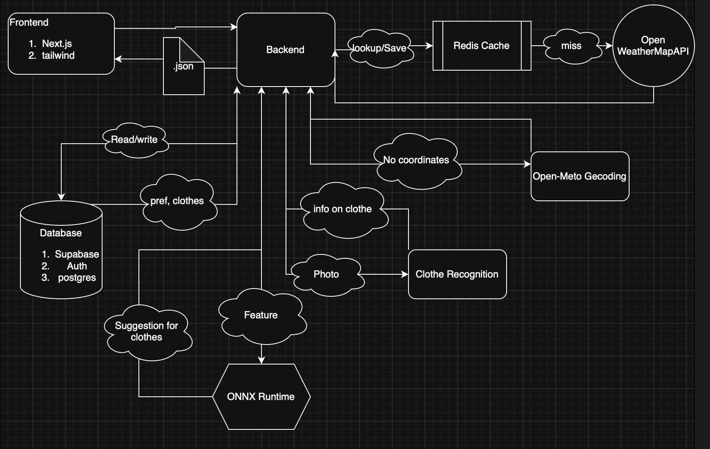

# Weather-Dress

Synopsis:

This project is a location-aware weather-based outfit recommendation system that helps users decide what to wear each day. By fetching real-time weather data (temperature, humidity, wind, precipitation, and UV index) from a public API, the system applies a rules engine to suggest suitable clothing layers, footwear, and accessories. The application tailors recommendations based on forecast conditions (e.g., rain → waterproof jacket and umbrella; high heat → breathable fabrics and sunglasses; snow → insulated boots and gloves). The frontend provides an intuitive interface where users can allow location access and instantly receive personalized outfit suggestions, while the backend handles weather API integration and decision logic. The goal of the project is to blend practical data-driven decision making with a user-friendly design, offering a daily utility that combines weather forecasting with personal comfort and style guidance.

STACK:

🌐 Frontend: Next.js (React) + Tailwind — Vercel (Hobby)

⚙️ Backend: FastAPI (Python) — Render/Railway (Free)
    Cache: Upstash Redis 
    Database: Supabase 

📡 Data Sources: Open-Meteo; 
                OpenWeathermap gelocation

🤖 AI/Personalization:
    Comfort Offset (Python or JS)
    Feedback Learning (Python: logistic regression or contextual bandit)
    Optional ONNX Runtime Web (client-side embeddings)

🛠️ Dev Tools: Git + GitHub; 
            Vercel deploy for frontend; 
            Render/Railway for backend; 
            Vitest/Jest (frontend) + Pytest (backend); 
            env vars in Vercel/Render dashboards

Diagram:
